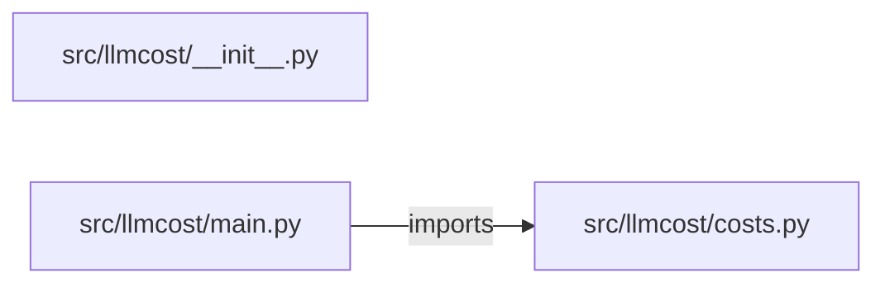

# llm-cost-monitoring-dashboard — project architecture

[README](README.md) · [Interview questions and answers](INTERVIEW_QA.md)

## Purpose and scope

Sum cost by service from posted lines and flag a budget miss.

This document describes files and symbols in this checkout. Deployment templates and statements in the original overview are distinguished from a verified running environment.

## Component diagram



For Python repositories, arrows show resolved local imports, not network calls or deployment order. Otherwise the diagram is a repository component map; containment arrows do not assert runtime integration.

## Components and responsibilities

| Component | Responsibility |
| --- | --- |
| [`src/llmcost/main.py`](src/llmcost/main.py) | HTTP handlers: `GET /healthz`, `POST /costs` |
| [`src/llmcost/costs.py`](src/llmcost/costs.py) | Functions: `summarize` |
| [`requirements.txt`](requirements.txt) | Implementation or supporting configuration |
| [`src/llmcost/__init__.py`](src/llmcost/__init__.py) | Implementation or supporting configuration |
| [`tests/test_costs.py`](tests/test_costs.py) | Executable checks and regression examples |
| [`.github/workflows/ci.yml`](.github/workflows/ci.yml) | GitHub Actions job definitions |
| [`README.md`](README.md) | Project explanations or operating notes |

## Request interface

| Method and path | Handler | Source |
| --- | --- | --- |
| `GET /healthz` | `healthz` | [`src/llmcost/main.py`](src/llmcost/main.py#L8) |
| `POST /costs` | `post_costs` | [`src/llmcost/main.py`](src/llmcost/main.py#L13) |

The table lists literal route decorators found in the inspected Python modules. Router prefixes and middleware can add behavior; check the linked handler and application setup before calling an endpoint.

## Implementation walkthrough

### `summarize(lines, budget=None)`

Source: [`src/llmcost/costs.py`](src/llmcost/costs.py#L5).

Calls visible in this function: `InputError`, `by_service.get`, `by_service.items`, `float`, `isinstance`, `line.get`, `round`, `str`.

```python
def summarize(lines, budget=None):
    if not isinstance(lines, list) or not lines:
        raise InputError("lines must be a non-empty list")
    by_service = {}
    total = 0.0
    for line in lines:
        try:
            amount = float(line["cost"])
        except (KeyError, TypeError, ValueError) as exc:
            raise InputError("each line needs a numeric cost") from exc
        svc = str(line.get("service", "unknown"))
        by_service[svc] = by_service.get(svc, 0.0) + amount
        total += amount
    over = budget is not None and total > budget
    return {
        "total": round(total, 4),
        "by_service": {k: round(v, 4) for k, v in by_service.items()},
        "over_budget": over,
        "applied": False,
    }
```

## Validation and failure paths

| Explicit exception | Source |
| --- | --- |
| `InputError('lines must be a non-empty list')` | [`src/llmcost/costs.py`](src/llmcost/costs.py#L7) |
| `InputError('each line needs a numeric cost')` | [`src/llmcost/costs.py`](src/llmcost/costs.py#L14) |
| `HTTPException(status_code=422, detail=str(exc))` | [`src/llmcost/main.py`](src/llmcost/main.py#L17) |

These are explicit exceptions in the inspected source, rather than a claim that every failure is handled. Follow the calling handler to see whether the exception becomes an HTTP response or propagates.

## Data flow and design decisions

### What is the input-to-output contract of `summarize`

In [`src/llmcost/costs.py`](src/llmcost/costs.py#L5), `summarize(lines, budget=None)` receives the inputs. The function computes these intermediate values:

- `by_service = {}`
- `total = 0.0`
- `over = budget is not None and total > budget`

Its result is defined by:

- `{'total': round(total, 4), 'by_service': {k: round(v, 4) for k, v in by_service.items()}, 'over_budget': over, 'applied': False}`

### Which decision rules or boundary conditions should an interviewer challenge

The implementation in [`src/llmcost/costs.py`](src/llmcost/costs.py#L5) branches on:

- `not isinstance(lines, list) or not lines`

A useful extension is a table-driven test that covers each condition just below, at, and above its boundary where applicable. These expressions are the current rules; changing them changes behavior and should be justified by the project’s acceptance criteria.

## Setup and verification

The following commands are derived from the checked-in dependency/test contracts. Execute them from the repository root; the block prepares a local environment, not a cloud deployment.

```bash
python3 -m venv .venv
source .venv/bin/activate
python -m pip install -r requirements.txt
python -m pytest -q
```

Python dependencies: [`requirements.txt`](requirements.txt).

Test entry points: [`tests/test_costs.py`](tests/test_costs.py).

Automation definitions: [`.github/workflows/ci.yml`](.github/workflows/ci.yml). Read their triggers and job steps to determine what CI actually runs.

## Operating boundaries and design review

Before turning this checkout into a customer deployment, establish the input contract, data ownership, access controls, failure response, evaluation criteria, and rollback owner. Repository fixtures and unit tests demonstrate local behavior; they do not establish throughput, uptime, compliance, or business impact.

A useful architecture review starts with the linked implementation: identify where input enters, where a decision is made, which state can change, and which external dependency can fail. Add a deployment view only for infrastructure that is actually configured and exercised.
